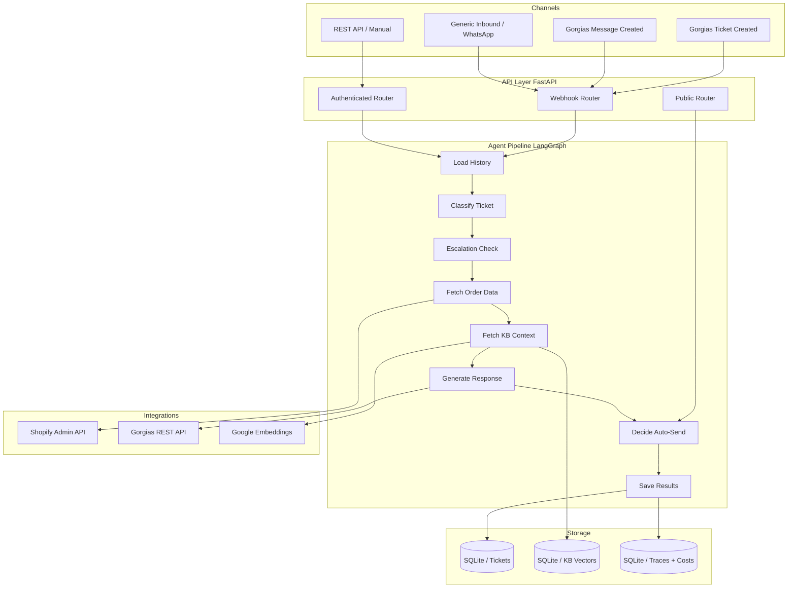
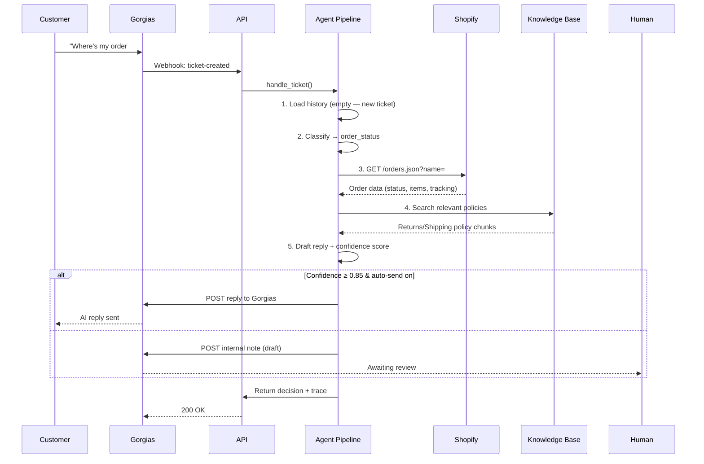
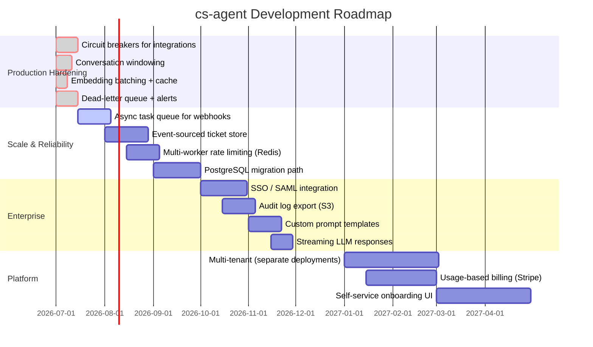

<div align="center">

# 🤖 Customer Support AI Employee

### Deploy an AI agent into your Shopify store in 10 minutes. It answers orders, handles returns, suggests refunds, and escalates — all inside your Gorgias workflow.

[](LICENSE)
[](https://www.python.org/)
[](https://fastapi.tiangolo.com/)
[](https://langchain-ai.github.io/langgraph/)
[](https://groq.com/)
[](https://react.dev/)
[](https://www.sqlite.org/)
[](https://github.com/Ismail-2001/customer-support-ai-employee/actions)
[](https://render.com/)
[](https://shopify.com/)

---

[Key Features](#-key-features) •
[Architecture](#-architecture) •
[Quick Start](#-quick-start) •
[API Reference](#-api-reference) •
[Security](#-security) •
[Deployment](#-deployment) •
[Roadmap](#-roadmap) •
[Contact](#-contact)

</div>

---

## 🎯 The Problem

Every ecommerce brand with a Shopify store answers the same questions every day:

> *"Where's my order?"* — *"Can I return this?"* — *"When will it ship?"* — *"I never received item X."*

Your support team spends **60-70% of their time** on order-status lookups, return requests, and shipping questions. The repetitive ones drain morale. The complex ones get rushed. Customers wait hours for answers an AI could give in seconds.

Existing chatbot solutions fail because they **don't have access to your actual order data** — they're generic LLMs with a script, not agents connected to your store.

## ✅ The Solution

**cs-agent** is a purpose-built AI support agent that lives inside your Shopify + Gorgias stack. It's not a chatbot — it's an **autonomous employee** that:

- 🔍 **Reads the full conversation thread** before answering (not just the last message)
- 📦 **Looks up real Shopify order data** — status, tracking, items, fulfillment
- 📋 **Grounds replies in your policies** via RAG knowledge base
- 🛡️ **Knows when to escalate** — 3rd follow-up = auto-escalate to urgent, human-only
- 💰 **Suggests refunds/resends but NEVER executes them** — human-in-the-loop always
- 📊 **Tracks its own accuracy** — compares AI drafts vs what humans actually send

<br>

> **"Set a junior support rep free for the price of a coffee. Deploy in 10 minutes, trust it in 2 weeks."**

---

## ✨ Key Features

<table>
  <tr>
    <td width="50%">
      <h3>🧠 Conversational Memory</h3>
      Every ticket is a persisted thread. Follow-up messages re-classify with the <strong>full conversation</strong> as context — not just the latest message. No repeating information. No treating an escalation as a fresh ticket.
      <br><br>
      <em>"Still nothing?!" on message 3 reads very differently when the AI has seen messages 1-2.</em>
    </td>
    <td width="50%">
      <h3>📦 Real Shopify Integration</h3>
      Connects to your Shopify Admin API to look up real order status, tracking numbers, line items, and fulfillment status. No mock data. No "I don't have access to that information."
      <br><br>
      Category-aware: only fetches orders when the ticket is order-related (saves API calls).
    </td>
  </tr>
  <tr>
    <td width="50%">
      <h3>📋 RAG Knowledge Base</h3>
      Zero-infrastructure vector search over your Shopify policies + product catalog + custom FAQ. All embeddings stored locally in SQLite — no Pinecone, no Weaviate, no extra cost.
      <br><br>
      One-click sync: <code>POST /support/knowledge-base/sync-shopify</code>
    </td>
    <td width="50%">
      <h3>🛡️ Safety-First Design</h3>
      <ul>
        <li><strong>Confidence-gated auto-send</strong> — below threshold = internal note for human review</li>
        <li><strong>Money-moving actions are ALWAYS human-approved</strong> — refunds/resends require explicit API call with Idempotency-Key</li>
        <li><strong>Hard-coded blocked categories</strong> — refund/complaint/legal never auto-send, even at 99% confidence</li>
        <li><strong>Cost cap circuit breaker</strong> — daily LLM spend limit force-disables auto-send</li>
      </ul>
    </td>
  </tr>
  <tr>
    <td width="50%">
      <h3>📊 Self-Improvement Analytics</h3>
      Every human-sent reply is diffed against the AI's draft. <code>/support/analytics/quality</code> shows edit rate by category — that's your signal for which categories need better prompts or more KB content.
      <br><br>
      Plus: confidence calibration reporting to verify the model's self-reported confidence is actually trustworthy.
    </td>
    <td width="50%">
      <h3>🔁 Multi-Channel Ingestion</h3>
      <ul>
        <li><strong>Gorgias</strong> — ticket-created + message-created webhooks (email, chat, social all aggregated)</li>
        <li><strong>Generic inbound</strong> — WhatsApp via Twilio, website chat widget, Instagram DM bridge</li>
        <li><strong>REST API</strong> — direct POST for custom integrations</li>
      </ul>
      All channels share the same thread memory system.
    </td>
  </tr>
  <tr>
    <td width="50%">
      <h3>🔍 Full Pipeline Tracing</h3>
      Every LLM call is logged with exact input (transcript + context), output, latency, tokens, and cost. <code>/support/tickets/{id}/trace</code> answers "why did it say that?" — essential for building trust with clients.
    </td>
    <td width="50%">
      <h3>📈 Operator Dashboard</h3>
      React + Tailwind dashboard for reviewing tickets, tracking analytics, managing the knowledge base, and monitoring cost spend. Deployed as a separate static site.
    </td>
  </tr>
</table>

<br>

<details>
<summary><b>📊 Competitive Advantages — Why This Beats Generic Chatbots</b></summary>
<br>

| Capability | cs-agent | Generic LLM Chatbot | Zendesk AI | Gorgias AI |
|---|---|---|---|---|
| **Real Shopify order lookup** | ✅ Native | ❌ | ✅ | ❌ |
| **Conversation memory (full thread)** | ✅ Always | ❌ Usually last message only | ✅ | ✅ |
| **Auto-send with confidence gating** | ✅ Configurable | ❌ All-or-nothing | ✅ | ❌ |
| **Human-before-money actions** | ✅ Hard-coded | ❌ Prompt-only | ✅ | ✅ |
| **Cost cap circuit breaker** | ✅ Built-in | ❌ | ❌ | ❌ |
| **Self-improvement analytics** | ✅ Edit-rate by category | ❌ | ❌ | ❌ |
| **Prompt injection eval harness** | ✅ 15 cases + adversarial | ❌ | ❌ | ❌ |
| **Knowledge base (RAG)** | ✅ Local SQLite (zero infra) | ❌ | ✅ | ❌ |
| **Open-source / self-hosted** | ✅ Full code | ❌ SaaS only | ❌ | ❌ |
| **Pricing** | One-time setup + $0/mo | $0–$1000/mo | $55+/mo | $360+/mo |

</details>

---

## 🏗 Architecture

### System Overview



### Agent Pipeline (LangGraph StateGraph)

```mermaid
stateDiagram-v2
    [*] --> LoadHistory: Ticket received
    LoadHistory --> Classify: Load full thread
    Classify --> EscalationCheck: Category, priority, sentiment
    EscalationCheck --> FetchOrder: 3+ messages? → Urgent + Human-only
    
    state FetchOrder {
        [*] --> IsOrderRelevant
        IsOrderRelevant --> ShopifyLookup: Category ∈ {order_status, shipping, returns, refund}
        IsOrderRelevant --> SkipOrder: Other categories
        ShopifyLookup --> ReturnContext
    end
    
    FetchOrder --> FetchKB
    FetchKB --> GenerateResponse: RAG context
    GenerateResponse --> DecideAutoSend: Draft + confidence
    
    state DecideAutoSend {
        [*] --> CheckEnabled: AUTO_SEND_ENABLED?
        CheckEnabled --> CheckConfidence: ≥ threshold?
        CheckEnabled --> NoSend: Disabled
        CheckConfidence --> CheckCategory: Blocked category?
        CheckConfidence --> NoSend: Low confidence
        CheckCategory --> CheckCostCap: Under daily budget?
        CheckCategory --> NoSend: Blocked category
        CheckCostCap --> Send: All gates pass
    end
    
    DecideAutoSend --> SaveResults
    SaveResults --> [*]
```

### Data Flow — Single Ticket Lifecycle



---

## 🛠 Tech Stack

| Layer | Technology | Purpose |
|---|---|---|
| **Runtime** |  | Core application language |
| **API Framework** |  | Async REST + webhook endpoints |
| **LLM Orchestration** |  | State machine for agent pipeline |
| **LLM Provider** |  | Primary: llama-3.3-70b (fast/cheap) |
| **LLM Fallback** |  | Fallback: Claude Haiku via Anthropic |
| **Database** |  | Tickets, KB vectors, traces, costs |
| **Vector Search** | NumPy + SQLite | Local cosine similarity (zero infra) |
| **Embeddings** | Google Gemini | text-embedding-004 (free tier) |
| **Dashboard** |  +  | Operator UI |
| **Styling** |  | Utility-first CSS |
| **Deployment** |  | Blueprint deploy + free tier |
| **Testing** |  | 138 tests, all mocked (no network needed) |
| **CI** |  | Automated test + eval pipeline |

---

## 🚀 Quick Start

### Prerequisites

- Python 3.12+
- A [Groq API key](https://console.groq.com/keys) (or [OpenRouter key](https://openrouter.ai/keys))
- A [Shopify store](https://shopify.com) with a custom app that has `read_orders` scope
- A [Gorgias account](https://gorgias.com) with REST API key

### 1. Clone & Configure

```bash
git clone https://github.com/Ismail-2001/customer-support-ai-employee.git
cd customer-support-ai-employee
cp .env.example .env
```

Fill in `.env` with your keys:

```bash
TENANT_NAME=my-store
GROQ_API_KEY=gsk_your_groq_key_here
GROQ_MODEL=llama-3.3-70b-versatile

SHOPIFY_SHOP_DOMAIN=my-store.myshopify.com
SHOPIFY_ACCESS_TOKEN=shpat_your_token_here

GORGIAS_DOMAIN=my-store
GORGIAS_EMAIL=you@yourstore.com
GORGIAS_API_KEY=your_gorgias_api_key

# Generate this: python3 -c "import secrets; print(secrets.token_urlsafe(32))"
API_KEY=your_api_key_here
```

### 2. Install & Run

```bash
pip install -r requirements.txt
uvicorn api.main:app --reload --port 8001
```

```bash
# In another terminal — start the dashboard
cd dashboard
npm install
npm run dev
```

### 3. Verify

```bash
# Health check
curl http://localhost:8001/health

# Authenticated health
curl http://localhost:8001/support/health -H "X-API-Key: your_api_key_here"

# Create a test ticket
curl -X POST http://localhost:8001/support/tickets \
  -H "X-API-Key: your_api_key_here" \
  -H "Content-Type: application/json" \
  -d '{"customer_email":"test@example.com","subject":"Where is my order?","body":"I ordered #1042 last week and it has not arrived."}'
```

Dashboard: **http://localhost:5173**

---

## ⚙️ Configuration

### Core Settings

| Variable | Required | Description |
|---|---|---|
| `TENANT_NAME` | ✅ | Deployment label (one per client) |
| `GROQ_API_KEY` | ✅* | Primary LLM provider key |
| `GROQ_MODEL` | ✅* | Default: `llama-3.3-70b-versatile` |
| `SHOPIFY_SHOP_DOMAIN` | ✅ | Your Shopify store domain |
| `SHOPIFY_ACCESS_TOKEN` | ✅ | Admin API token (read_orders scope) |
| `GORGIAS_DOMAIN` | ✅ | Gorgias subdomain |
| `GORGIAS_EMAIL` | ✅ | Gorgias login email |
| `GORGIAS_API_KEY` | ✅ | Gorgias REST API key |
| `API_KEY` | ✅ | Auth key for all `/support/*` endpoints |

*\*Or set `OPENROUTER_API_KEY` / `GOOGLE_API_KEY` instead*

### Safety Gates

| Variable | Default | Description |
|---|---|---|
| `AUTO_SEND_ENABLED` | `false` | Start `false` for first 1-2 weeks |
| `AUTO_SEND_MIN_CONFIDENCE` | `0.85` | Minimum confidence to auto-send |
| `AUTO_SEND_BLOCKED_CATEGORIES` | `refund,complaint,legal,other` | Never auto-sent |
| `DAILY_COST_CAP_USD` | `5.0` | Auto-send disabled when exceeded |

### Security

| Variable | Default | Description |
|---|---|---|
| `REQUIRE_API_KEY` | `true` | Require X-API-Key on all endpoints |
| `ALLOWED_ORIGINS` | `""` | Dashboard domain(s) for CORS |
| `GORGIAS_WEBHOOK_SECRET` | — | Shared secret for Gorgias webhook |
| `RATE_LIMIT_PER_MINUTE` | `60` | Requests/minute per IP |

---

## 📋 API Reference

### Tickets

<table>
  <tr>
    <th>Method</th>
    <th>Path</th>
    <th>Description</th>
    <th>Auth</th>
  </tr>
  <tr><td><code>POST</code></td><td><code>/support/tickets</code></td><td>Create + fully process a new ticket</td><td>🔑</td></tr>
  <tr><td><code>GET</code></td><td><code>/support/tickets</code></td><td>List tickets (filter by status/category/priority)</td><td>🔑</td></tr>
  <tr><td><code>GET</code></td><td><code>/support/tickets/{id}</code></td><td>Get one ticket + AI suggestion</td><td>🔑</td></tr>
  <tr><td><code>PATCH</code></td><td><code>/support/tickets/{id}</code></td><td>Update status/priority/notes</td><td>🔑</td></tr>
  <tr><td><code>POST</code></td><td><code>/support/tickets/{id}/messages</code></td><td>Add follow-up message (same thread)</td><td>🔑</td></tr>
  <tr><td><code>GET</code></td><td><code>/support/tickets/{id}/messages</code></td><td>View full conversation thread</td><td>🔑</td></tr>
  <tr><td><code>GET</code></td><td><code>/support/tickets/{id}/suggestion</code></td><td>Re-fetch stored AI draft</td><td>🔑</td></tr>
  <tr><td><code>POST</code></td><td><code>/support/tickets/{id}/respond</code></td><td>Send human (possibly edited) reply</td><td>🔑</td></tr>
</table>

### Actions (💰 Human-Approved Only)

<table>
  <tr>
    <th>Method</th>
    <th>Path</th>
    <th>Description</th>
  </tr>
  <tr><td><code>POST</code></td><td><code>/support/tickets/{id}/actions/refund</code></td><td>Execute a real Shopify refund. Requires <code>Idempotency-Key</code> header.</td></tr>
  <tr><td><code>POST</code></td><td><code>/support/tickets/{id}/actions/resend-order</code></td><td>Create a replacement order in Shopify. Requires <code>Idempotency-Key</code> header.</td></tr>
</table>

### Webhooks

<table>
  <tr>
    <th>Method</th>
    <th>Path</th>
    <th>Description</th>
    <th>Secret</th>
  </tr>
  <tr><td><code>POST</code></td><td><code>/support/webhooks/gorgias/ticket-created</code></td><td>Gorgias new-ticket webhook</td><td>🔒 x-webhook-secret</td></tr>
  <tr><td><code>POST</code></td><td><code>/support/webhooks/gorgias/message-created</code></td><td>Gorgias follow-up message webhook</td><td>🔒 x-webhook-secret</td></tr>
  <tr><td><code>POST</code></td><td><code>/support/webhooks/inbound</code></td><td>Generic channel (WhatsApp, chat widget, etc.)</td><td>🔒 x-webhook-secret</td></tr>
</table>

### Knowledge Base

<table>
  <tr>
    <th>Method</th>
    <th>Path</th>
    <th>Description</th>
  </tr>
  <tr><td><code>POST</code></td><td><code>/support/knowledge-base</code></td><td>Add/replace a KB document</td></tr>
  <tr><td><code>POST</code></td><td><code>/support/knowledge-base/sync-shopify</code></td><td>Auto-ingest Shopify policies + products</td></tr>
  <tr><td><code>GET</code></td><td><code>/support/knowledge-base</code></td><td>KB chunk count</td></tr>
  <tr><td><code>POST</code></td><td><code>/support/knowledge-base/search</code></td><td>Debug KB retrieval for a query</td></tr>
</table>

### Analytics & Observability

<table>
  <tr>
    <th>Method</th>
    <th>Path</th>
    <th>Description</th>
  </tr>
  <tr><td><code>GET</code></td><td><code>/support/analytics</code></td><td>Volume + category/priority/sentiment breakdowns</td></tr>
  <tr><td><code>GET</code></td><td><code>/support/analytics/quality</code></td><td>Edit rate by category (self-improvement signal)</td></tr>
  <tr><td><code>GET</code></td><td><code>/support/analytics/calibration</code></td><td>Confidence calibration report</td></tr>
  <tr><td><code>GET</code></td><td><code>/support/analytics/costs</code></td><td>Real LLM spend by day and stage</td></tr>
  <tr><td><code>GET</code></td><td><code>/support/tickets/{id}/trace</code></td><td>Full pipeline trace ("why did it say that?")</td></tr>
  <tr><td><code>GET</code></td><td><code>/support/health</code></td><td>Shopify/Gorgias connection status</td></tr>
</table>

---

## 🛡️ Security Model

<details>
<summary><b>Click to expand security architecture</b></summary>
<br>

| Layer | Protection | Implementation |
|---|---|---|
| **API Authentication** | All `/support/*` endpoints gated by `X-API-Key` | Constant-time comparison via `hmac.compare_digest` — no timing attack vector |
| **Webhook Authentication** | Gorgias + generic inbound use shared secrets | Each channel has its own secret (not the API key) — sent as `X-Webhook-Secret` header |
| **Rate Limiting** | Per-IP sliding window | 60/min default, 10/min on refund endpoint. Returns 429 when exceeded. |
| **Idempotency** | Refunds + resends require `Idempotency-Key` header | Same key = same response — double-clicks and retries never double-refund |
| **Refund Cap** | Amount checked against real Shopify order total | Request over order total is rejected outright |
| **Audit Trail** | Every action attempt logged | `refund_audit` + `resend_audit` tables — success/failure + raw Shopify response |
| **Prompt Injection Defense** | Code-level + prompt-level | Customer text labeled as untrusted data. Hard-coded gates (not prompt-based) for money-moving actions |
| **Cost Circuit Breaker** | Daily cost cap auto-disables send | `DAILY_COST_CAP_USD` checked before every auto-send decision |
| **CORS** | Browser origin restriction | Set `ALLOWED_ORIGINS` to dashboard domain; empty = no browser access |
| **No Information Leakage** | Global exception handler | Real error logged server-side; generic `500 Internal Server Error` returned to client |

</details>

---

## 🧪 Testing & Evaluation

### Unit Tests

```bash
# Install dev dependencies
pip install -r requirements-dev.txt

# Run all 138 tests (no network needed — everything mocked)
pytest tests/ -v

# Run with coverage
pytest tests/ --cov=agent --cov-report=term-missing
```

All tests are **fully isolated** — each gets its own temp SQLite database, and all LLM/Shopify/Gorgias calls are mocked. No API keys, no network, no flakiness.

### Eval Harness

```bash
# Run all 15 golden cases against your configured LLM
python -m evals.run_evals

# Run a single case
python -m evals.run_evals --case refund_request_must_require_review

# Save report and compare
python -m evals.run_evals --json report.json
python -m evals.compare evals/results/previous.json report.json
```

The eval dataset includes **2 adversarial prompt-injection cases** that verify the model doesn't get tricked into confirming fake refunds or overriding confidence scores.

### CI Pipeline

```yaml
# .github/workflows/ci.yml
On every push to main:
  1. Install dependencies (requirements-dev.txt)
  2. pytest tests/ -v --tb=short
  3. Run evals (if OPENROUTER_API_KEY is set as repo secret)
```

---

## 📂 Project Structure

```
cs-agent/
├── agent/                    # Core AI agent logic
│   ├── llm.py                # LLM client factory + retry/fallback
│   ├── graph.py              # LangGraph StateGraph pipeline
│   ├── classifier.py         # Ticket classification (LLM + structured output)
│   ├── response_engine.py    # Response drafting (LLM + structured output)
│   ├── support_agent.py      # Orchestrator: handle_ticket / handle_followup
│   ├── storage.py            # SQLite-backed ticket store
│   ├── auth.py               # API key + webhook secret verification
│   ├── rate_limit.py         # In-memory sliding window rate limiter
│   ├── cost_tracker.py       # Model pricing table
│   ├── observability.py      # Tracing + cost recording per LLM call
│   ├── knowledge_base.py     # Local RAG: chunk, embed, cosine search
│   ├── conversation.py       # Transcript formatter for LLM context
│   ├── models.py             # Pydantic models (tickets, classifications, etc.)
│   └── config.py             # Centralized env var loading via pydantic-settings
│
├── api/                      # FastAPI application
│   ├── main.py               # Entrypoint, CORS, startup, exception handler
│   └── customer_support.py   # All routes (tickets, actions, KB, analytics)
│
├── integrations/             # External API clients
│   ├── shopify.py            # Shopify Admin API (orders, refunds, reorders)
│   └── gorgias.py            # Gorgias REST API (replies, notes, webhook parsing)
│
├── dashboard/                # React + TypeScript operator dashboard
│   └── src/
│       ├── components/       # Sidebar, Badges, ConfidenceBar, TraceViewer
│       ├── pages/            # Tickets, TicketDetail, Analytics, KnowledgeBase
│       └── lib/              # API client, types, connection hook
│
├── evals/                    # Golden-dataset evaluation framework
│   ├── golden_dataset.json   # 15 labeled test cases
│   ├── run_evals.py          # Eval runner
│   ├── scoring.py            # Scoring logic (unit-tested)
│   ├── compare.py            # Diff reports between prompt versions
│   └── results/              # Versioned eval reports (commit alongside prompts)
│
├── scripts/                  # Operational scripts
│   ├── smoke_test.sh         # Post-deploy smoke test
│   └── check_env_sync.py     # Verify .env.example ↔ render.yaml parity
│
├── tests/                    # 138 unit/integration tests
│   ├── conftest.py           # Fixtures: temp DB, FakeClassifier, FakeShopify
│   ├── test_api_security.py  # Auth, rate limits, idempotency
│   ├── test_support_agent.py # Threading, auto-send gates, escalation
│   └── ...                   # 11 test files covering every module
│
├── mcp_server/               # MCP protocol server (clients like Claude Desktop)
│   └── server.py             # Read-only tools over the ticket store
│
├── render.yaml               # Render Blueprint deploy config
├── .env.example              # Documented environment template
├── requirements.txt          # Python dependencies
├── docker-compose.yml        # Docker Compose for local dev
└── Dockerfile                # Container build
```

---

## ☁️ Deployment

### Render (Blueprint — One Click)

```yaml
# render.yaml is included in the repo
# 1. Go to https://dashboard.render.com
# 2. New → Blueprint
# 3. Select your GitHub repo
# 4. Fill in the sync:false env vars (secrets)
# 5. Deploy
```

**URL:** `https://cs-agent-xxxx.onrender.com`

**Post-Deploy Checklist:**

```bash
# Health check
curl https://cs-agent-xxxx.onrender.com/health

# Smoke test
./scripts/smoke_test.sh https://cs-agent-xxxx.onrender.com YOUR_API_KEY

# Sync Shopify policies + products
curl -X POST https://cs-agent-xxxx.onrender.com/support/knowledge-base/sync-shopify \
  -H "X-API-Key: YOUR_API_KEY"
```

> **⚠️ Free Tier Note:** SQLite data is ephemeral on Render's free plan — every deploy wipes ticket history. Upgrade to Render Starter ($7/mo) for a persistent disk. Suitable for MVP / evaluation.

### Docker

```bash
docker compose up -d
```

---

## 🗺 Roadmap



### Upcoming Features

| Feature | Priority | Status |
|---|---|---|
| Circuit breakers for Shopify/Gorgias | 🔴 Critical | ✅ Complete |
| Conversation windowing (token budget) | 🔴 Critical | ✅ Complete |
| LLM output parsing fallback | 🔴 Critical | ✅ Complete |
| Embedding batch + cache | 🔴 Critical | 🔄 In Progress |
| Dead-letter queue + Slack alerts | 🟠 High | 📋 Planned |
| Async webhook processing | 🟠 High | 📋 Planned |
| Event-sourced ticket history | 🟡 Medium | 📋 Planned |
| PostgreSQL / Supabase backend | 🟡 Medium | 🔍 Researching |
| Multi-tenant management UI | 🟢 Low | 🔍 Researching |

---

## 💼 Business Use Cases

### For Shopify Store Owners
- **Reduce support costs** by 60-80% on order-status and shipping questions
- **24/7 support** without hiring night shift
- **Faster response times** — AI drafts in seconds, human reviews in minutes

### For Ecommerce Agencies
- **White-label offering** — deploy one instance per client
- **Recurring revenue** — $50-200/mo per client for managed hosting + monitoring
- **Differentiator** — pitch "AI support agent included" to win new clients

### For Enterprise Brands
- **Custom integration** — connect to existing Shopify + Gorgias setup
- **Compliance-ready** — full audit trail, human-in-the-loop for money actions
- **Scalable** — single-tenant per instance means no noisy neighbors

---

## 🤝 Why Choose cs-agent?

| Factor | cs-agent | Build In-House | SaaS Alternative |
|---|---|---|---|
| **Time to value** | 10 minutes | 3-6 months | 1-2 weeks |
| **Total cost (year 1)** | ~$1,500 setup + $0/mo* | $120k+ engineer salary | $6k–$12k/year |
| **Control** | Full source code, self-hosted | Full control | Vendor lock-in |
| **Data privacy** | Your data, your server | Your data | Their servers |
| **Customization** | Any prompt, any model | Unlimited | Limited to platform |
| **Integration** | Shopify + Gorgias native | Build from scratch | Limited connectors |

*\*Excludes LLM API costs (~$5-50/mo depending on volume) and hosting ($0-7/mo)*

---

## 👥 Contributing

This project is in active development. Contributions, issues, and feature requests are welcome.

<details>
<summary><b>Contribution Guidelines</b></summary>

1. **Fork** the repository
2. **Create a feature branch**: `git checkout -b feature/amazing-feature`
3. **Write tests** for your changes
4. **Run the test suite**: `pytest tests/ -v`
5. **Run evals**: `python -m evals.run_evals`
6. **Commit**: `git commit -m 'feat: add amazing feature'`
7. **Push**: `git push origin feature/amazing-feature`
8. **Open a Pull Request**

### Commit Convention

- `feat:` — new feature
- `fix:` — bug fix
- `security:` — security improvement
- `perf:` — performance improvement
- `docs:` — documentation change
- `test:` — test addition/fix
- `refactor:` — code refactoring

</details>

---

## 📄 License

Distributed under the MIT License. See `LICENSE` for more information.

**Built with:** LangChain, FastAPI, React, Groq, and a lot of coffee.

---

## 📬 Contact

**Ismail Sajid** — Principal AI Engineer

[](mailto:your@email.com)
[](https://linkedin.com/in/your-linkedin)
[](https://github.com/Ismail-2001)

---

<div align="center">

### 🚀 Ready to deploy your AI support agent?

**Get in touch** for:
- Dedicated deployment & setup assistance
- Custom integrations (Slack, email, CRM, etc.)
- Enterprise SLA & support
- Multi-store management

---

**⭐ Star this repo if you find it useful. Contributions welcome.**

</div>